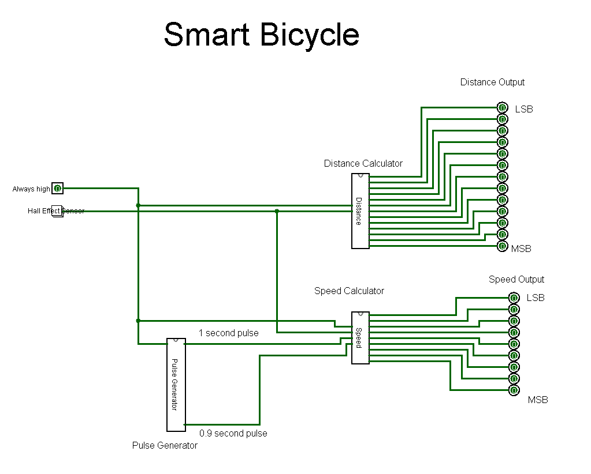
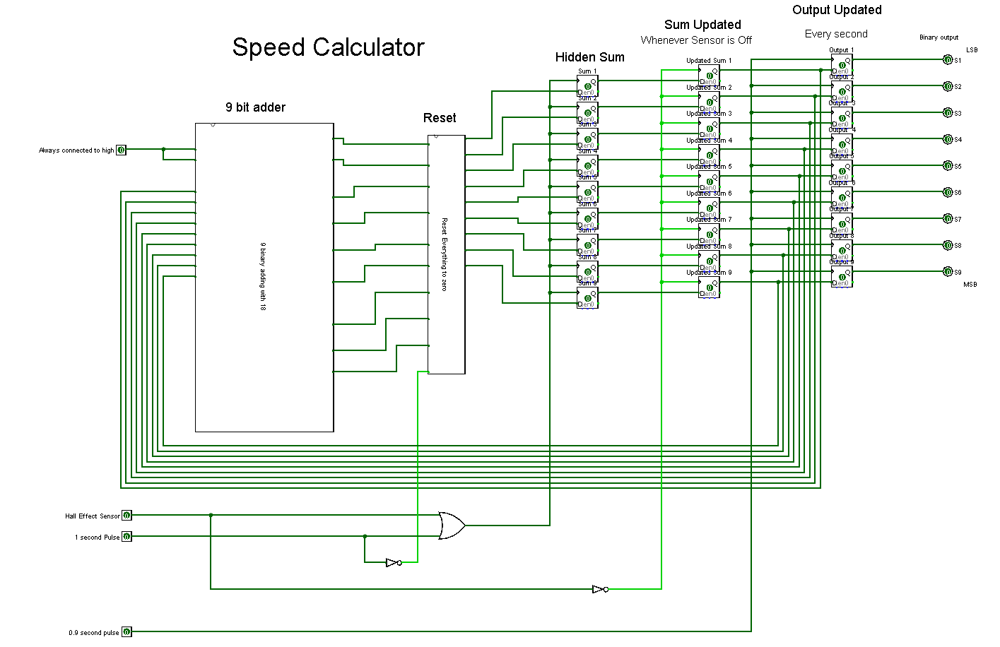
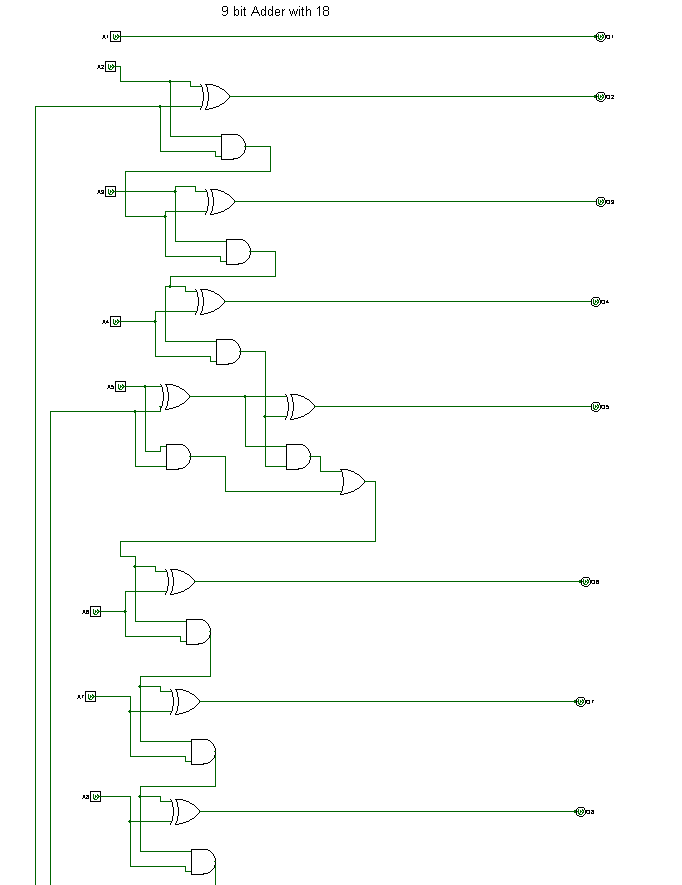
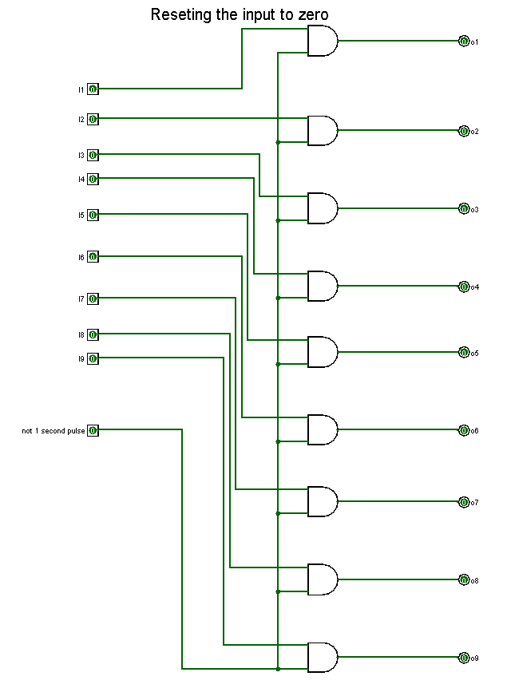
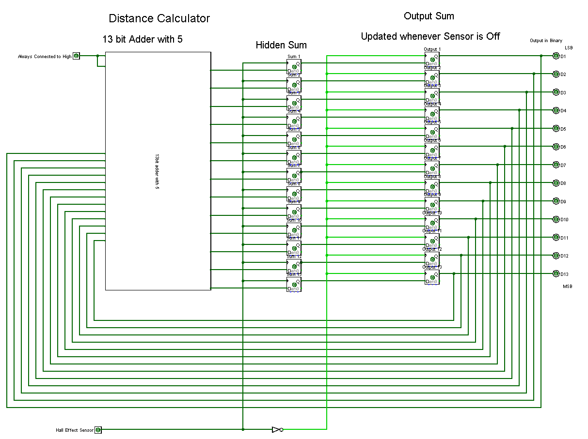
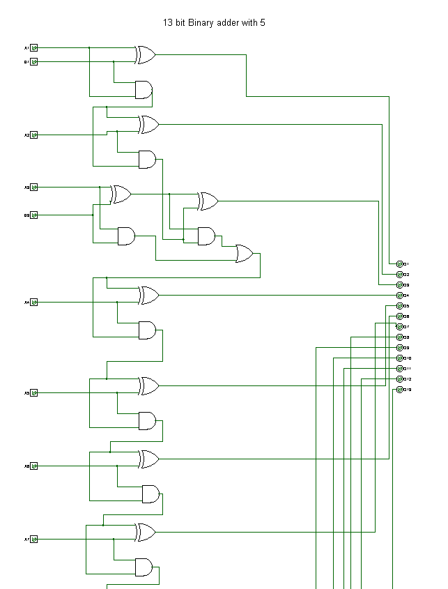
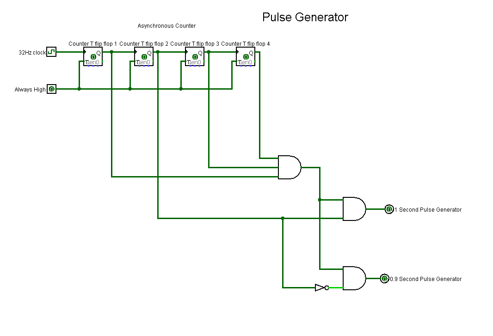
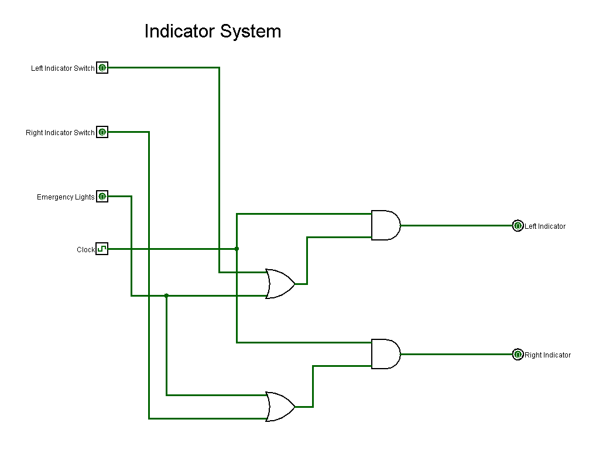

# Smart Bycycle

<!-- First Section -->
## Team Details
<details>
  <summary>Detail</summary>

  > Semester: 3rd Sem B. Tech. CSE

  > Section: S1

  > Member-1: Aditya G, 221CS106, adityag.221cs106@nitk.edu.in

  > member-2: Amruth S D, 221CS108, amruthsd.221cs108@nitk.edu.in 

  > Member-3: Thrishank Reddy, 221CS160, thrishankreddymure.221cs160@nitk.edu.in
</details>

<!-- Second Section -->
## Abstract
<details>
  <summary>Detail</summary>
  
  > In an era marked by rapid technological growth and an increasing emphasis on
sustainability, the integration of electronics and smart systems into everyday
activities is becoming increasingly prevalent. One such area of innovation is the
realm of cycling, where traditional bicycles are evolving into 'smart'
transportation solutions that offer enhanced functionality and safety. Our
project focuses on the development of a 'Smart Bicycle'. Central to this
innovation is the incorporation of a digital speedometer, a vital component for
cyclists seeking accurate real-time data on their speed, distance travelled, and
performance metrics. The digital speedometer project hinges on three key
components. Firstly, the Hall Effect Sensor plays a pivotal role by detecting
wheel rotation on the vehicle, serving as the primary data source for measuring
speed. Secondly, the Seven Segment Display takes this speed data and presents
it in a visually understandable numerical format, making it easily readable to
the user. Together, these components form a cohesive system for accurately
measuring and displaying vehicle speed. The addition of direction indicators is
more than just a feature; it's a step toward making cycling in urban
environments safer and more accessible.
</details>

<!-- Third Section -->
## Working
<details>
  <summary>Detail</summary>

  BRIEF DESCRIPTION
  
The miniproject is called smart bicycle, its main functions are displaying the
bicycle's speed(km/hr),distance travelled by the bicycle(m), also a button for
indicators if the user wants to take a turn etc, so the the implementation of all
the features can be divided into 4 major parts.

1.Clock handling(for displaying accurate speed and reseting it)

2.Calculating current speed and distance travelled(Using flipflops and adders)

3.Implementing the indicator

Let us start with indicator part:

Indicator Buttons:
You have three buttons - left indicator, right indicator, and parking lights. Each
button serves a specific purpose:

Left Indicator: When pressed, this button activates the left turn indicator,
signaling to other road users that the cyclist intends to make a left turn.
Right Indicator: When pressed, this button activates the right turn indicator,
indicating the cyclist's intention to make a right turn
Parking Lights: This button activates the parking lights. When the parking lights
are on, both the left and right indicators blink simultaneously, and this is
commonly used when the cyclist wants to make their presence more noticeable,
especially in low-light conditions or while stationary.

OR Gates: To begin, the state of the right indicator button and the parking lights
button are connected to one OR gate, while the state of the left indicator button
and the parking lights button are connected to another OR gate. These OR gates
act as logic elements that combine the state of the buttons.
Clock Input: The output of each OR gate is then linked to an AND gate.
Additionally, the state of a clock signal is provided as the second input to these
AND gates.

Parking Lights: When the parking lights button is pressed, it activates both OR
gates, causing both left and right indicators to blink. The clock signal plays a
crucial role here.

Indicator Activation:
If only the left indicator button is pressed, the left indicator OR gate will have a
high (1) output, and the clock signal will be used to control the blinking effect.
Similarly, if only the right indicator button is pressed, the right indicator OR gate
will have a high output, and the clock signal will control the blinking of the right
indicator.

When the parking lights button is pressed, both OR gates will have high outputs,
and the clock signal will cause both the left and right indicators to blink together.
This setup offers a versatile indicator system that responds to the cyclist's
intentions. Whether they want to signal a left turn, a right turn, or activate both
indicators for enhanced visibility, the system can accommodate these actions
effectively. The clock signal synchronizes the blinking effect, making the turn
indicators noticeable and informative to other road users, ultimately enhancing
safety while cycling

Now let us talk about the speed and distance travelled part:
Distance does not need to be reset, it just needs to be initialized at 0 and we
keep adding 0.5 meters every time the hall effect sensor
sends a pulse whenever the magnet is detected and the same pulse also adds
1.8 to the speed counter and we also need to make sure to reset it every
second(because speed continously changes so we need it to be as accurate as
possible) so we need to keep a counter and update its value every time a
magnet is detected and then we need to copy it(the output stays constant for
the second and keeps getting updated every second) and then reset it. The
speed counter is of 9 bits and the distance counter is of 13 bits, we can store the
values in D flipflops and use full adder/half adder to increase the value.

Clock handling part:
Now we could just use a simple 1hz clock to reset and copy it but there are 2
main problems. 1)Inaccurate, after some research we found out that 1hz clocks
can be very inaccurate and unreliable) 2)Delay between copy and reset, One
more potential problem was if the speed got resetted before it was copied to
the output then the output would always show 0 and that would be a huge
problem, hence we decided to use 15Hz clock, so how we mimic a 1Hz clock is
we store a 4 bit counter and increase it every time the 15Hz clock gives a pulse,
and if all the bits are 1(AND of all the bits, this happens every 1 second) a pulse
is given out to reset it, so to copy before this we also send another pulse if the
bit configuration is 1110(which is just before 1111) so the speed value is copied
just before it is reset.

Functional Table:

Inputs Result

HES (1sec Pulse) (0.9sec Pulse)  Speed  Distance

0 0 0 NA NA

0 0 1 (Updates Display) NA

0 1 0 (Resets Speed) NA

0 1 1 -----------------------------------

1 0 0 (+1.8 to Hidden speed) (+0.5 to distance and Updates)

1 0 1 (Updates speed) (+0.5 to Distance and Updates)

1 1 0 (Resets Speed) (+0.5 to Distance and Updates)

1 1 1 ---------------------------------------
</details>

<!-- Fourth Section -->
## Logisim Circuit Diagram
<details>
  <summary>Detail</summary>
  
  Main
  
  
  
  Speed
  
  
  
  9 bit adder
  
  
  
  reset
  
  
  
  Distance
  
  
  
  13 bit adder
  
  
  
  Pulse Generator
  
  
  
  Indicator
  
  
</details>

<!-- Fifth Section -->
## Verilog Code
<details>
  <summary>Detail</summary>

.V file
  ```
module speed(clk,reset,result);
  input clk,reset;
  output [8:0]result;
  reg [8:0] spe;
  always @(posedge clk or posedge reset) begin
    if (reset) begin
      spe <= 9'b0;
    end else begin
      spe <= spe + 18;
    end

  end
  assign result = spe;

endmodule

module distance(clk,reset2,result);
  input clk,reset2;
  output [12:0]result;
  reg [12:0]dist;
  always @(posedge clk or posedge reset2) begin
    if (reset2) begin
      dist <= 13'b0;
    end else begin
      dist <= dist + 5;
    end
  end
  assign result = dist;
endmodule

```

Test Bench

```
module miniproject_tb;

  reg clk;        
  reg reset,reset2;       
  wire [8:0] result1;
  wire [12:0] result2; 

  speed M1(clk,reset,result1);
  distance M2(clk,reset2,result2);
  // Assuming hall effect sensor as a clock with 100Hz frequency
  always begin
    #5 clk = ~clk;
  end
  initial begin
    #5 reset2=~reset2;
    #5 reset2=~reset2;
    #5 reset=~reset;
    #5 reset=~reset;
  end
  // Reset value (1 Hz)
  always begin
    #500 reset = ~reset;
    #5 reset= ~reset;
  end
  
  initial begin
    $display("Time,Speed,Distance");
    $monitor("%d, %b %b", $time,result1,result2);
    #10000 $finish;
  end

  initial begin
    clk = 0;
    reset = 0;
    reset2=0;
  end

endmodule

```
</details>

<!-- Sixth Section -->
## References
<details>
  <summary>Detail</summary>

  1. Building a Digital Speedometer by zagGrad
https://www.sparkfun.com/tutorials/123
2. EMBEDDED LINUX, FEATURED, SPEEDOMETER PROJECT
by Braden Sunwold
https://barenakedembedded.com/diy-speedometer//
3. Bike Turning Signal Circuit by Iftar Rafiq
https://www.electronicshub.org/bike-turningsignalcircuit/#:~:text=Breadboard
4. Basic working of D flip
flophttps://www.geeksforgeeks.org/d-flipflop/#:~:text=The%20basic%20working%20of%20D,the%
20flip%20flop's%20Q%20output
5. Asynchronous Counter
https://electronicscoach.com/asynchronous-counter.html
</details>
